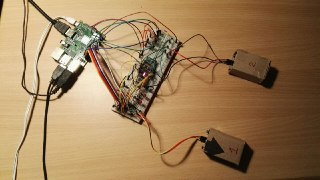
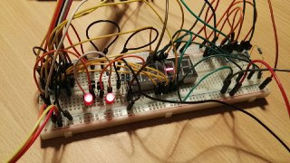
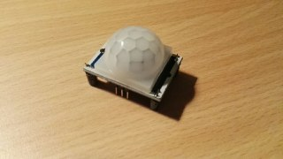
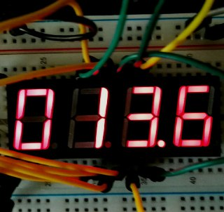
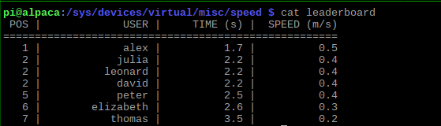

# SpeedoMeter

SpeedoMeter is a Linux kernel module that controls a homemade device to measure speed (a speed camera, basically) and display it.
The module also offers a bunch of additional features, including the history of past measurements in a ranking fashion.

## Hardware

* Raspberry Pi 3 Model B
* 2x PIR sensors
* 2x LED
* 4-digits 7-segments display
* Breadboard
* 9x Resistors
* 6x NPN transistors
* Many wires

This is how the whole circuit looks like:

With a zoom on the breadboard:

And this is one of the two PIRs used:

## How does it work

From a user perspective, the device is represented by an entry in /dev, but it is also present is sysfs.
PIR sensors are positioned at fixed distance (which can be specified when loading the module). When someone (or something) walks in front of any of the two sensors, an interrupt is sent to the kernel (via RPi GPIO) and handled, storing the associated timestamp. 
The speed is then easily computed dividing the sensors distance by the difference between these two timestamps.
The kernel also maintains a leaderboard of users and their best time, sorted by speed.

